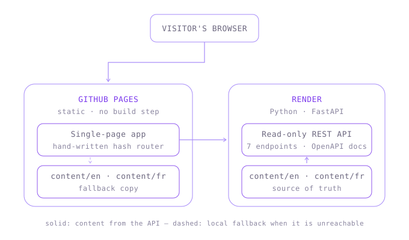

# Architecture

## Overview

A single-page application served as static files, backed by a Python REST API.

See the diagram above.

## The frontend is a hand-written SPA

`script.js` contains four layers:

1. **Data layer** — `getContent(name)` fetches a content set and caches it in a
   `Map`, so returning to a page costs nothing.
2. **Views** — one object per page with `title`, `render()` returning an HTML
   string, and an optional `mount()` for event listeners that can only be
   attached after the markup exists.
3. **Router** — `matchRoute()` compiles a path pattern like `/projects/:slug`
   into a regular expression and extracts the parameters. `renderRoute()` swaps
   the contents of `<main id="app">`.
4. **Chrome** — theme toggle, mobile menu and scroll state. These live outside
   the router because the header and footer never re-render.

## Decisions and why

**Hash routing (`#/projects`) rather than clean paths.** With `/projects`, a
refresh sends that path to the server, and GitHub Pages answers 404 because no
such file exists. The fragment never reaches the server, so refreshes,
bookmarks and the back button work on static hosting with no rewrite rules.

**No frontend framework.** The site is six views with light interactivity.
React would add a build step, a dependency tree and a bundle to solve problems
this page does not have. The router that replaces it is about twenty-five lines.

**Content in JSON, not in code.** Everything personal lives in `content/*.json`.
Updating the portfolio means editing data; `main.py`, `index.html` and
`script.js` contain no personal content.

**Two sources for the same content.** `getContent` requests the API first and
falls back to the same JSON files served as static assets. The site is fully
readable when the backend is asleep, redeploying or simply not running locally.
In practice the site is fully usable with the backend switched off.

**FastAPI over Flask.** Validation, serialization and OpenAPI documentation come
from type hints via Pydantic, so there is no hand-written request checking, and
`/docs` is generated from the code.

**No database.** The contact page links straight to email, LinkedIn and GitHub,
so nothing is written server-side. A database that stores nothing is a liability
to maintain, not a feature — it was removed once the form was dropped.

**Theming through custom properties.** Every color is a token in `:root`,
overridden under `html[data-theme="dark"]`. The toggle sets one attribute;
nothing else in the CSS knows dark mode exists.

**Motion is opt-out at the system level.** The aurora animation, page
transitions and scroll reveals are all disabled under
`prefers-reduced-motion: reduce`.

## Known limitations

- **SEO.** Crawlers that do not execute JavaScript see an empty `<main>`.
  Acceptable for a portfolio reached from a CV or an application, and solvable
  later with pre-rendering if it matters.
- **Content is cached at process start** (`lru_cache`), so editing a JSON file
  needs a restart. `--reload` handles this locally; production needs a redeploy.
- **Render's free tier sleeps after inactivity**, so the first API call can take
  30–60 seconds. The static fallback means the visitor never sees a blank page,
  but the content they read may briefly come from the fallback copy rather than
  the API.
- **Content is duplicated** between `content/en` and `content/fr`. Structural
  changes have to be made twice; a schema check in CI would catch drift.
